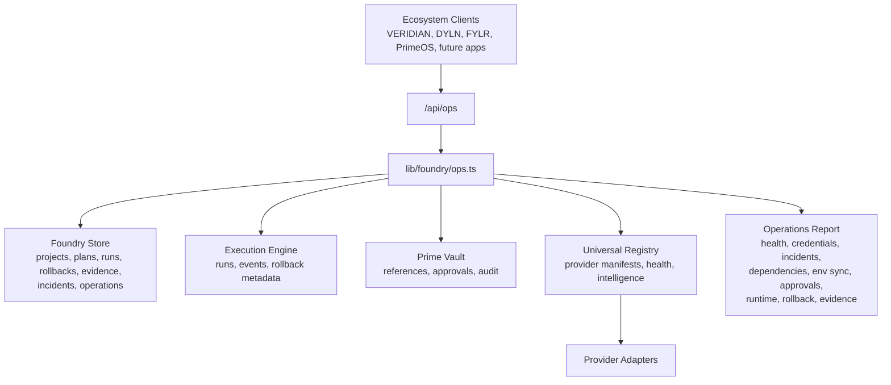

# Foundry M4: Autonomous Operations Center

Foundry M4 turns the existing execution engine, provider intelligence, vault controls, and persistence layer into a reusable operations control plane for any ecosystem product. The implementation is product-agnostic and lives in `lib/foundry/ops.ts` with a protected API at `app/api/ops/route.ts`.

## What It Covers

- Provider intelligence: availability, latency, failures, quota pressure, cost estimate, confidence, and health score.
- Credential intelligence: metadata-only discovery, classification, ownership, dependency mapping, expiry/rotation detection, approval sensitivity, and verification state.
- Incident response: durable operational incidents with severity, impact, affected projects, dependencies, recommended actions, rollback plan, and evidence.
- Dependency discovery: project-to-provider and provider-to-provider graphing, shared-provider blast radius, and integration risk analysis.
- Environment synchronization: development/staging/production parity checks for missing, inconsistent, stale, or invalid secret references.
- Approval engine: organization-scoped pending/approved/rejected rollups and action-level manual approval queue visibility.
- Runtime health: persistence probe, run inventory, verification inventory, provider-plane health, and a composite control-plane score.
- Rollback engine audit: available/completed/failed rollback inventory plus missing post-rollback verification detection.
- Evidence ledger: every ops scan and incident action writes a durable `operations` record with inputs, outputs, verification steps, runtime proof, and residual risk.

## Architecture



## Operational Flow

1. `GET /api/ops` authenticates a principal and runs a full operational scan.
2. Provider probes update rolling health state and emit provider evidence.
3. Credential and environment scans remain metadata-only and never resolve secret values.
4. Derived incident sync converts unhealthy providers, risky credentials, and parity gaps into durable incidents.
5. Dependency and runtime analysis produce blast-radius and system-health views.
6. Every stage appends operation evidence to the store for auditability and runtime proof.

## Reuse Contract

- No product-specific provider logic exists in the ops layer.
- Dependency graphing derives only from plans, runs, and provider metadata.
- Secret analysis uses references and encrypted custody records only.
- Incident and evidence schemas are generic enough for any future product.

## Runtime Proof

Run:

```bash
npm run proof:m4
```

The script provisions two mock-backed projects, executes a run, triggers rollback, creates credential/environment drift, queues a production approval, and verifies that the operations report detects those conditions with durable evidence.
